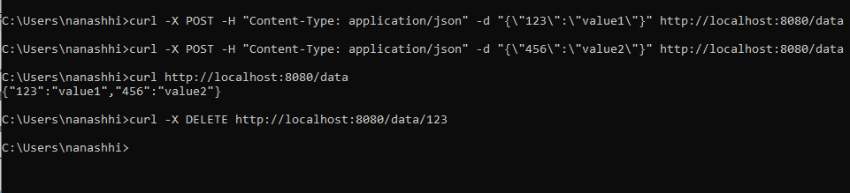

# Assignment 2 - Basic Web Server

## How to Run

1. Install Go (version 1.20 or later).
2. Clone this repository or unzip the folder.
3. Open the folder in VS Code.
4. Run `go mod init Assignment2_TomirisTapen` to initialize the module.
5. Run `go run main.go` to start the server.
6. Access the server endpoints:
   - POST `/data` - Add data (JSON format).
   - GET `/data` - Retrieve all data.
   - GET `/stats` - Get request and database stats.
   - DELETE `/data/{key}` - Remove a specific key.




## API Endpoints and Example Commands

### **1. POST /data**
**Description:** Adds data to the in-memory database.

**Command:**
```bash
curl -X POST -H "Content-Type: application/json" -d "{\"key\":\"value\"}" http://localhost:8080/data
```
**Expected Result:**
- HTTP status: `201 Created`.
- Adds a key-value pair to the database.

---

### **2. GET /data**
**Description:** Fetches all key-value pairs from the in-memory database.

**Command:**
```bash
curl http://localhost:8080/data
```
**Expected Result:**
- Returns JSON with all stored key-value pairs, e.g., `{"key":"value"}`.

---

### **3. GET /stats**
**Description:** Fetches server statistics, including the total number of requests and the size of the database.

**Command:**
```bash
curl http://localhost:8080/stats
```
**Expected Result:**
- Returns JSON with statistics, e.g., `{"requests":3,"db_size":1}`.

---

### **4. DELETE /data/{key}**
**Description:** Deletes a specific key from the in-memory database.

**Command:**
```bash
curl -X DELETE http://localhost:8080/data/key
```
**Expected Result:**
- Removes the specified key from the database.

---

## Testing Notes

- Use `curl` commands in the terminal, Postman, or any HTTP client to test the server.
- The server listens on `http://localhost:8080` by default.
- Press `CTRL+C` in the terminal to gracefully stop the server.

---

## Example Test Workflow

1. **Add Data:**
   ```bash
   curl -X POST -H "Content-Type: application/json" -d "{\"key1\":\"value1\"}" http://localhost:8080/data
   curl -X POST -H "Content-Type: application/json" -d "{\"key2\":\"value2\"}" http://localhost:8080/data
   ```

2. **Retrieve All Data:**
   ```bash
   curl http://localhost:8080/data
   ```

3. **Check Statistics:**
   ```bash
   curl http://localhost:8080/stats
   ```

4. **Delete a Key:**
   ```bash
   curl -X DELETE http://localhost:8080/data/key1
   ```

5. **Verify Deletion:**
   ```bash
   curl http://localhost:8080/data
   ```


